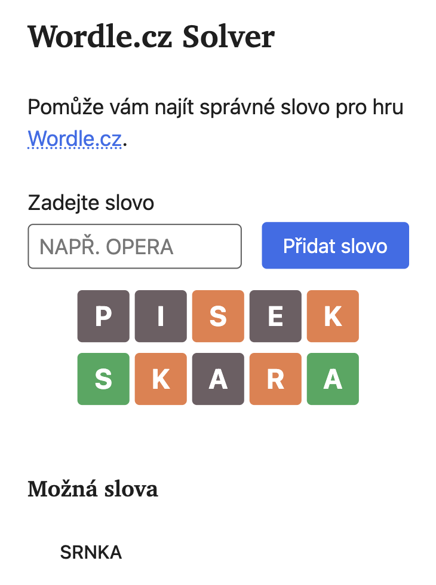

# wordle-cz-solver

Web-based solver for the Czech version of [Wordle.cz](https://www.wordle.cz). Helps you find possible words based on your guesses.



## Features

- **Interactive Grid**: Click letters to set colors based on Wordle feedback
- **Smart Algorithm**: Precise letter constraint handling with exact count enforcement
- **Czech Word Database**: 2,863 words with diacritic normalization
- **Real-time Suggestions**: Shows possible words as you add guesses
- **URL Sharing**: Game state automatically saved in URL for easy sharing
- **Mobile-Friendly**: Built with [KelpUI](https://kelpui.com) for responsive design
- **No Build Tools**: Pure HTML/CSS/JavaScript

## Word Database

The Czech word list (`words.txt`) contains 2,863 five-letter words extracted from the `allWords` constant in [Wordle.cz's JavaScript file](https://www.wordle.cz/wordle.js). Words are stored concatenated without separators and normalized (diacritics removed) for consistent matching.

## How to Use

1. Open `index.html` in a web browser
2. Enter a 5-letter word and click "Přidat slovo"
3. Click letters to set colors:
   - **Gray**: Letter not in word
   - **Orange**: Letter in word, wrong position  
   - **Blue**: Letter in correct position + appears elsewhere (minimum count)
   - **Green**: Letter in correct position + exact count (no more instances)
4. View suggestions in "Možná slova" section

## Development

### Local Development

For development, serve the files using a local HTTP server (required for ES modules):

```bash
# Install serve globally
npm install -g serve

# Run development server
serve

# Open http://localhost:3000 in your browser
```

Alternatively, you can use any other static file server like Python's `http.server` or Live Server in VS Code.

### Technologies

- **HTML5**: Semantic markup with Web Components
- **CSS3**: Modern styling with custom properties
- **JavaScript**: ES6+ modules and features
- **[KelpUI](https://kelpui.com)**: Lightweight CSS framework

### Algorithm

The solver uses a sophisticated constraint-checking algorithm that properly handles Wordle's letter counting rules:

- **Green letters**: Enforce exact count (if A is green, word has exactly that many A's)
- **Blue letters**: Require minimum count (letter at position + appears elsewhere)
- **Mixed constraints**: Green takes precedence over orange/blue for count enforcement
- **Czech normalization**: Handles diacritics correctly (`á` → `a`)

### Testing

Run comprehensive test suites:

```bash
node tests/algorithm.test.js         # Core algorithm (19 tests)
node tests/wordle-scenarios.test.js  # Real-world scenarios (8 tests)
node tests/integration.test.js       # Integration tests
```
